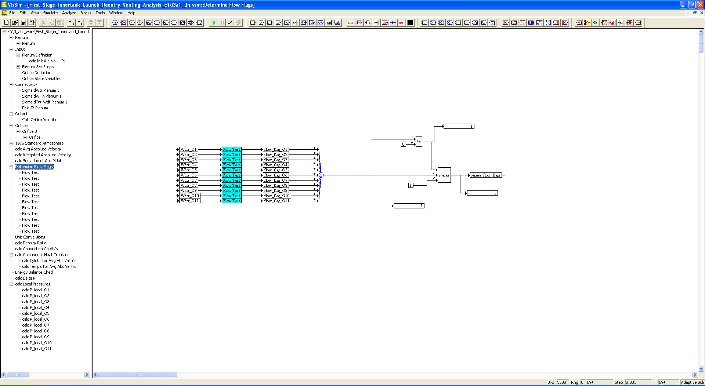

# ========================================
# First Stage Innertank Ascent/Reentry Venting Thermal Analysis using VISSIM:
# ========================================

## First Stage Innertank Ascent/Reentry Venting Thermal Analysis using VISSIM.

##
## I. Operation: "./VISSIM/First_Stage_Innertank_Launch_Reentry_Venting_Analysis_c1d3a1_lin.vsm"

##
## II. Ascent/Reentry Venting Thermal Analysis Top Level Diagram:

##
## III. Plenum Sub-System Level Diagram:

##
## IV. Input Sub-System Level Diagram:

##
## V. Connectivity Sub-System Level Diagram:

##
## VI. Output Sub-System Level Diagram:

##
## VII. Orifices Sub-System Level Diagram:

##
## VIII. 1976 Standard Atmosphere Model Sub-System Level Diagram:

##
## IX. Determine Flow Flags Sub-System Level Diagram:

##
## X. Component Heat Transfer Sub-System Level Diagram:

##
## XI. Energy Balance Check Sub-System Level Diagram:

##
## XIIa. Results: "./VISSIM/lap_intertank_h_q.out"
## XIIb. Results: "./VISSIM/lap_intertank_mdot.dat"
## XIIc. Results: "./VISSIM/lap_intertank_plenum.dat"
## XIId. Results: "./VISSIM/lap_intertank_temp.dat"
## XIIe. Results: "./VISSIM/lap_intertank_vel.dat"
## 
## *Note: 
## 1. Performance Data and Analysis performed using VISSIM, ( https://web.solidthinking.com/vissim-is-now-solidthinking-embed )

